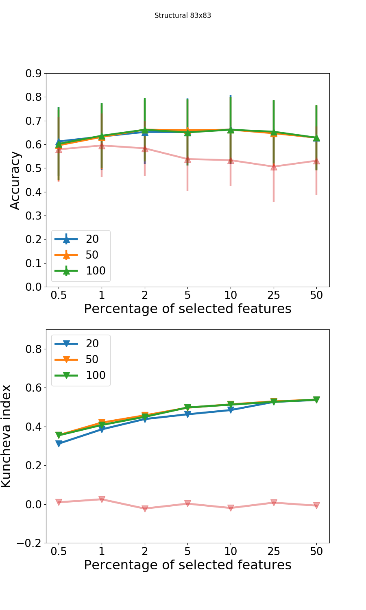
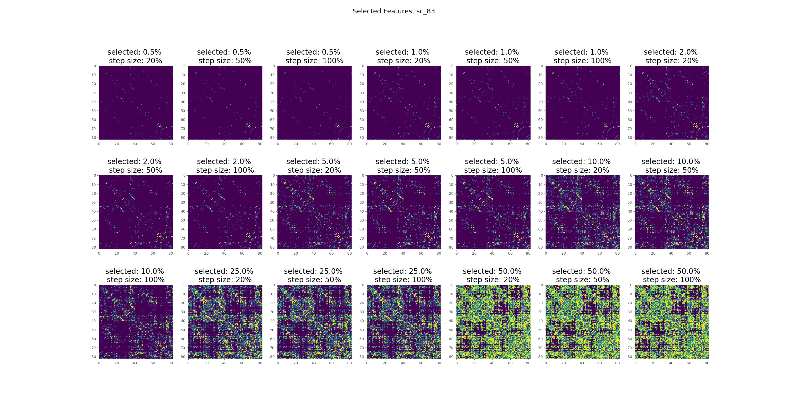
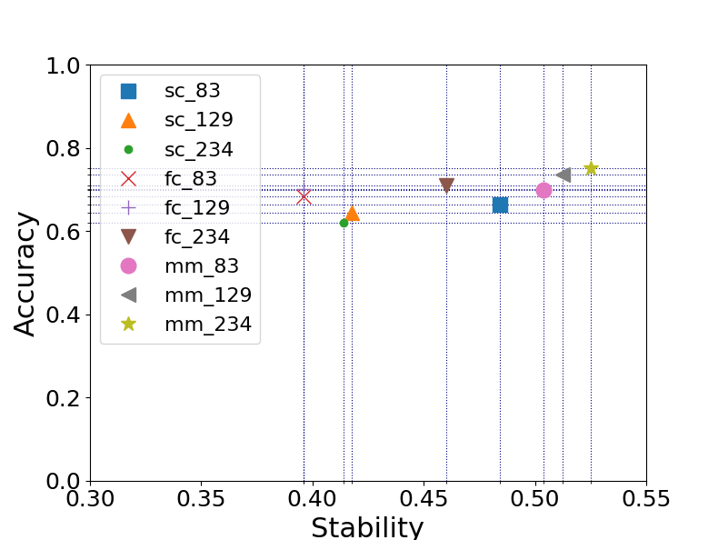

## Stable Biomarker Identification For Predicting Schizophrenia in the Human Connectome
*Leonardo Gutiérrez-Gómez,  Jakub Vohryzek, Benjamin Chiêm, Philipp S. Baumann, Philippe Conus, Kim Do Cuenod, Patric Hagmann and Jean-Charles Delvenne.*


Here you can find the scripts to reproduce the results of our paper. Check out the preprint [here](https://www.biorxiv.org/content/10.1101/711135v1)


This code was tested on Linux/Mint 18.2 with python 2.7.

## Usage
The entire dataset can be downloded from [Zenodo](https://doi.org/10.5281/zenodo.3758534). The Funcitonal and Structural connectivity matrices should be vectorized and saved in the folders FC and SC.

### Finding stable biomarkers for schizophrenia prediction
The following script will run recursive feature elimination, support vector machines (RFE-SVM) to select features, compute the stability of selected biomarkers and predicting schizophrenia. 

Example,
```
python mainScript_abs.py -connectivity Structural -resolution 83
```
Will run RFE-SVM on structural connectomes with 83 x 83 parcellations. The results are saved in the *mat/abs_subcortical* folder.

### Plotting results
Plotting accuracy and stability for different parameters. Figures will be saved in the *results/* folder as .png files.

```
python plotting_accuracy_stability.py
```
example, structural 83 x 83 connectome:
<p align="center">

</p>

You can also plot the selected biomarkers and visualize them as a 'connectivity' matrices:

```
python plotting_selected_features_matrices.py
```
<p align="center">

</p>


### Accuracy versus stability of biomarkers
Best tradeoff between accuracy and stability.
```
python plotting_stab_vs_acc.py
```
<p align="center">

</p>

### Compute the affected core (a-core) in schizophrenia
```
python acore_distribution.py -connectivity Multimodal -resolution 83 -type Structural
```
This script will compute the a-core of the structural biomarkers extracted from the Multimodal connectome of parcellation 83 x 83.

### Citing
Soon bibtex entry.

### Others

Please send any questions you might have about the code and/or the paper to leonardo.gutierrez@list.lu, jakub.vohryzek@queens.ox.ac.uk or benjamin.chiem@uclouvain.be.
